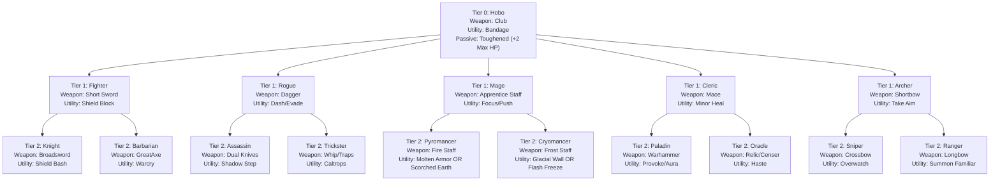

```mermaid
graph TD
    %% TIER 0: The Beginning
    Hobo["Tier 0: Hobo<br/>Weapon: Club<br/>Utility: Bandage<br/>Passive: Toughened (+2 Max HP)"]

    %% TIER 1: The Archetypes
    Fighter["Tier 1: Fighter<br/>Weapon: Short Sword<br/>Utility: Shield Block"]
    Rogue["Tier 1: Rogue<br/>Weapon: Dagger<br/>Utility: Dash/Evade"]
    Mage["Tier 1: Mage<br/>Weapon: Apprentice Staff<br/>Utility: Focus/Push"]
    Cleric["Tier 1: Cleric<br/>Weapon: Mace<br/>Utility: Minor Heal"]
    Archer["Tier 1: Archer<br/>Weapon: Shortbow<br/>Utility: Take Aim"]

    %% TIER 2: The Specializations (Fighter)
    Knight["Tier 2: Knight<br/>Weapon: Broadsword<br/>Utility: Shield Bash"]
    Barbarian["Tier 2: Barbarian<br/>Weapon: GreatAxe<br/>Utility: Warcry"]

    %% TIER 2: The Specializations (Rogue)
    Assassin["Tier 2: Assassin<br/>Weapon: Dual Knives<br/>Utility: Shadow Step"]
    Trickster["Tier 2: Trickster<br/>Weapon: Whip/Traps<br/>Utility: Caltrops"]

    %% TIER 2: The Specializations (Mage)
    Pyromancer["Tier 2: Pyromancer<br/>Weapon: Fire Staff<br/>Utility: Molten Armor OR Scorched Earth"]
    Cryomancer["Tier 2: Cryomancer<br/>Weapon: Frost Staff<br/>Utility: Glacial Wall OR Flash Freeze"]

    %% TIER 2: The Specializations (Cleric)
    Paladin["Tier 2: Paladin<br/>Weapon: Warhammer<br/>Utility: Provoke/Aura"]
    Oracle["Tier 2: Oracle<br/>Weapon: Relic/Censer<br/>Utility: Haste"]

    %% TIER 2: The Specializations (Archer)
    Sniper["Tier 2: Sniper<br/>Weapon: Crossbow<br/>Utility: Overwatch"]
    Ranger["Tier 2: Ranger<br/>Weapon: Longbow<br/>Utility: Summon Familiar"]

    %% The Progression Flow
    Hobo --> Fighter
    Hobo --> Rogue
    Hobo --> Mage
    Hobo --> Cleric
    Hobo --> Archer

    Fighter --> Knight
    Fighter --> Barbarian

    Rogue --> Assassin
    Rogue --> Trickster

    Mage --> Pyromancer
    Mage --> Cryomancer

    Cleric --> Paladin
    Cleric --> Oracle

    Archer --> Sniper
    Archer --> Ranger
```